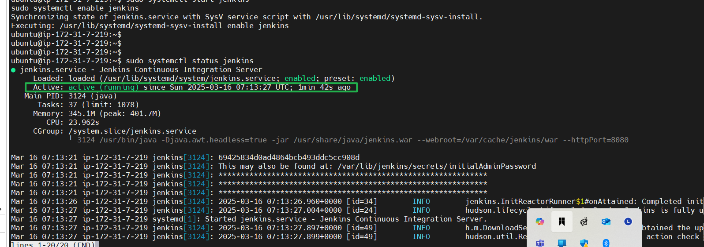

# AUTOMATING-DEPLOYMENT-OF-AN-E-COMMERCE-WEBSITE--JENKINS-PROJECT

Sure, Eddie! Let’s walk through each step together to ensure you can automate the deployment of your e-commerce website using Jenkins. I’ll provide detailed instructions for every phase of the project.

---

### **1. Jenkins Server Setup**
**Objective:** Configure Jenkins for CI/CD pipeline automation.

#### Steps:
1. **Install Jenkins:**
   - Download Jenkins from [jenkins.io](https://www.jenkins.io/).
   - If you're using Linux:
     For Ubuntu: 
       ```bash
       sudo apt update
       sudo apt install openjdk-11-jdk
       wget -q -O - https://pkg.jenkins.io/debian/jenkins.io.key | sudo apt-key add -
       sudo sh -c 'echo deb http://pkg.jenkins.io/debian-stable binary/ > /etc/apt/sources.list.d/jenkins.list'
       sudo apt update
       sudo apt install jenkins
---

Explaination of the commands.

#### **1. `sudo apt update`**
This command updates the list of available packages and their versions on your system. It ensures that your system is aware of the latest updates and available software from the configured repositories. 

- `sudo`: Runs the command with administrative (superuser) privileges.
- `apt`: The package management tool for Debian-based systems like Ubuntu.
- `update`: Updates the package index.

---

#### **2. `sudo apt install openjdk-11-jdk`**
This command installs OpenJDK version 11, which includes the Java Development Kit (JDK). Jenkins requires Java to run, and JDK 11 is a common version for compatibility.

- `install`: Tells the package manager to install the specified software.
- `openjdk-11-jdk`: The name of the package you want to install.

---

#### **3. `wget -q -O - https://pkg.jenkins.io/debian/jenkins.io.key | sudo apt-key add -`**
This command downloads and adds the Jenkins GPG (GNU Privacy Guard) key to your system.

- `wget`: A tool to fetch files from the web.
- `-q`: Runs `wget` in quiet mode (no output shown).
- `-O -`: Directs the downloaded content to standard output (`-`) rather than saving it to a file.
- `https://pkg.jenkins.io/debian/jenkins.io.key`: The URL of the Jenkins key.
- `|`: Pipes the output of `wget` to the next command.
- `sudo apt-key add -`: Adds the Jenkins GPG key to your system's trusted keys, allowing secure installation of Jenkins.

---

#### **4. `sudo sh -c 'echo deb http://pkg.jenkins.io/debian-stable binary/ > /etc/apt/sources.list.d/jenkins.list'`**
This command adds the Jenkins repository to your system's package sources.

- `sh -c`: Runs the enclosed command in a shell.
- `echo deb http://pkg.jenkins.io/debian-stable binary/`: Outputs the repository information.
- `> /etc/apt/sources.list.d/jenkins.list`: Redirects the output to a new file called `jenkins.list` in the directory where package sources are stored.

By adding this repository, your system knows where to find the official Jenkins packages for installation.

---

#### **5. `sudo apt update`**
This command is repeated to refresh the package list after adding the Jenkins repository. It ensures the new repository is considered during installations.

---

#### **6. `sudo apt install jenkins`**
This command installs Jenkins on your system.

- `jenkins`: The package name of the Jenkins software.

---

      CentOS:

       ```bash
       sudo yum install java-11-openjdk
       sudo wget -O /etc/yum.repos.d/jenkins.repo https://pkg.jenkins.io/redhat-stable/jenkins.repo
       sudo rpm --import https://pkg.jenkins.io/redhat-stable/jenkins.io.key
       sudo yum install jenkins
       ```
   **Start Jenkins**:

     ```bash
     sudo systemctl start jenkins
     sudo systemctl enable jenkins
     ```
  


2. **Set up plugins:**
   - Log in to Jenkins at `http://<server-ip>:8080` (use the initial admin password found in `/var/lib/jenkins/secrets/initialAdminPassword`).

   Make sure port 8080 is opened in the jenkins server inbound rules.
   
    

    Navigate to **Manage Jenkins > Manage Plugins**.

     Initial password can be found using the command
     `journalctl -u jenkins`.Use the password to login and create a new user.
      
    
    

   
    Install **Git**, **Docker Pipeline**, and any other necessary plugins.

    

    Create a new Jenkins user and save.

    
    

3. **Secure Jenkins:**

    Go to **Manage Jenkins > Configure Global Security**.

    Set up **Matrix-Based Security** to control access for different users.

    Enable HTTPS using an SSL certificate.

    Set other security measures as desired.
   
   


---

### **2. Source Code Management Repository Integration**
**Objective:** Connect Jenkins with your GitHub repository.

#### Steps:
1. **Integrate with GitHub:**
   - Install the **GitHub Integration Plugin**.
   - Go to **Manage Jenkins > Configure System**, and add GitHub credentials (Personal Access Token from GitHub).

    **Generate a GitHub Personal Access Token**

   Log in to your GitHub account.

   Go to Settings > Developer Settings > Personal Access Tokens > Tokens (classic).

   Click Generate new token and select the required scopes:

   repo: For private repositories.

   admin:repo_hook: For managing webhooks.

   Copy the generated token (you won’t be able to see it again).

   
    In your freestyle or pipeline job, under **Source Code Management**, select **Git** and provide the repository URL.
    a) Create a freestye project

    Click on New item

    

    Provide a name and choose freestyle project.

    

    Click on the newly created freestyle project,click on configure and scroll down to `source code management` and choose `git`

    

    Go to your github and copy the repo URL.

    

    Chose git and provide this repo URL and the correct Branch specifier and save.

    


2. **Set up webhooks:**

   In your GitHub repository, go to **Settings > Webhooks**. 

   

   Add a new webhook with this URL: `http://<jenkins-server-ip>:8080/github-webhook/`.

    Choose **application/json** as the content type and select events that trigger the webhook.

   

   On the freestyle project,check the `GitHub hook trigger for GITScm polling`

   

---

### **3. Jenkins Freestyle Jobs for Build and Unit Tests**
**Objective:** Create and configure Jenkins jobs for building your application.

#### Steps:
1. **Create a Freestyle Job:**

    In Jenkins, click **New Item** and select **Freestyle Project**.

   

   

   Under **Source Code Management**, link your GitHub repository.

   

    In the **Build** section, add shell commands for building the app.
     ```bash
     mvn clean package
     ```

2. **Add Unit Tests:**

    Add another build step to run unit tests.
     ```bash
     mvn test
     ```

---

### **4. Jenkins Pipeline for Web Application**
**Objective:** Automate the entire deployment process using a Jenkins Pipeline.

#### Steps:
1. **Create a Pipeline Job:**
   - In Jenkins, click **New Item > Pipeline**.
   - Write or load a `Jenkinsfile` in the **Pipeline** section.

2. **Sample Jenkinsfile:**
   ```groovy
   pipeline {
       agent any
       stages {
           stage('Build') {
               steps {
                   sh 'mvn clean package'
               }
           }
           stage('Test') {
               steps {
                   sh 'mvn test'
               }
           }
           stage('Deploy') {
               steps {
                   sh 'docker-compose up -d'
               }
           }
       }
   }
   ```

---

### **5. Docker Image Creation and Registry Push**
**Objective:** Build Docker images and push them to a registry.

#### Steps:
1. **Build Docker Images:**
   - Create a `Dockerfile` in your project directory.
   - Configure Jenkins to execute Docker commands:
     ```bash
     docker build -t <image-name> .
     ```

2. **Run the Docker Container:**
   - Add a step in your Jenkins Pipeline:
     ```bash
     docker run -d -p 8080:80 <image-name>
     ```

3. **Push to Docker Hub:**
   - Configure Docker Hub credentials in Jenkins.
   - Add a step to push the image:
     ```bash
     docker login --username=<username> --password=<password>
     docker push <image-name>
     ```

---

With this guide, you should be able to complete each part of your project step by step. If you'd like me to expand on any part or troubleshoot as you go, just let me know—I’m here for you, Eddie!